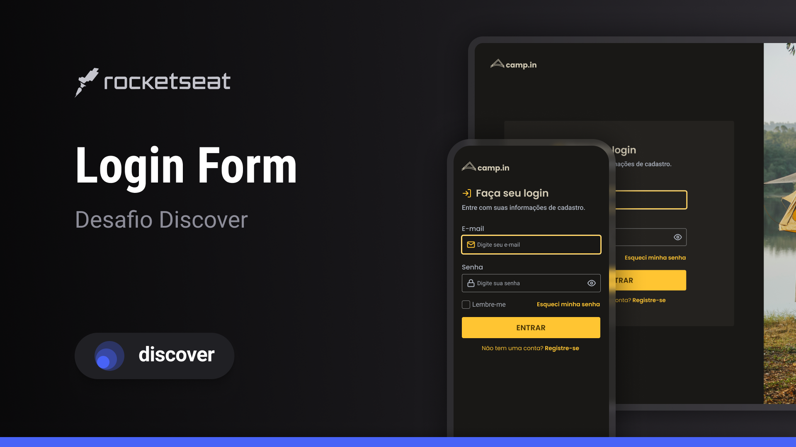

<h1 align="center">Login Form</h1>

  Projeto retirado dos desafios do Discover, um programa de estudo gratuito e exclusivo promovido pela Rocketseat para o ensino de tecnologias web.

  <a href="#-layout">Layout</a>&nbsp;&nbsp;&nbsp;|&nbsp;&nbsp;&nbsp;
  <a href="#-aprendizado">Aprendizado</a>&nbsp;&nbsp;&nbsp;|&nbsp;&nbsp;&nbsp;
  <a href="#-projeto">Projeto</a>&nbsp;&nbsp;&nbsp;|&nbsp;&nbsp;&nbsp;
  <a href="#-tecnologias">Tecnologias</a>&nbsp;&nbsp;&nbsp;|&nbsp;&nbsp;&nbsp;
  <a href="#-licença">Licença</a>

 

  

 

  

## 🎨 Layout

Você pode visualizar o layout do projeto através [DESSE LINK](https://www.figma.com/file/SX8XFyC5fAY09ai8Oykz0T/DD-%2F-Login-Form---CSS/duplicate).

## 📖 Aprendizado

- Implementei o conceito de mobile first, permitindo garantir uma experiência mais satisfatória para o usuário;
- Aprendi a usar os conceitos de focus e blur em inputs, através do uso do JavaScript. Esses recursos me ajudaram a melhorar a experiência do usuário, permitindo que eles se concentrem no que é importante no momento;
- Também aprendi a como visualizar a senha escondida de um input password utilizando o JavaScript. Isso me permitiu ajudar os usuários que eventualmente esqueceram a senha, ou precisavam confirmar a senha que estavam digitando.

## 💻 Projeto

O desafio Login Form do Discover da Rocketseat tem como objetivo criar um formulário de login responsivo utilizando HTML, CSS e
JavaScript. O projeto consiste em desenvolver uma interface de usuário limpa e intuitiva que permita ao usuário inserir seu e-mail de usuário e senha para acessar uma aplicação. O desafio requer que o formulário de login tenha uma aparência agradável e moderna, com uso de elementos visuais apropriados para atrair e engajar o usuário.

## 🧪 Tecnologias

Esse projeto foi desenvolvido com as seguintes tecnologias:

- [HTML](https://developer.mozilla.org/pt-BR/docs/Web/HTML)
- [CSS](https://developer.mozilla.org/pt-BR/docs/Web/CSS)
- [JavaScript](https://developer.mozilla.org/pt-BR/docs/Web/JavaScript)
- [Git](https://git-scm.com)
- [Figma](https://www.figma.com)
- [ICONS8](https://icons8.com)

## 📝 Licença

Este projeto está sob a licença MIT. Consulte o arquivo [LICENSE](https://github.com/kauankarvalho/Login-Form-CSS/blob/main/LICENSE) para obter mais detalhes.
